# LevelledMobs → Fabric / LampasCore Port: Chunked Execution Plan

This document breaks down the master architectural porting specification [`porting/PLAN.md`](file:///C:/Users/markj/source/repos/LevelledMobs/porting/PLAN.md) into 12 structured, manageable, and self-contained execution chunks.

---

## Roadmap Overview & Dependency Graph

```mermaid
graph TD
    C0["Chunk 0: Pre-Port Audit & Feature Matrix"] --> C1["Chunk 1: Fabric Skeleton & Vertical Slice MVP"]
    C1 --> C2["Chunk 2: Context Abstractions & Rule Engine Core"]
    C2 --> C3["Chunk 3: Levelling Strategy Subsystem"]
    C2 --> C4["Chunk 4: Attribute Scaling Engine & Combat Pipeline"]
    C1 --> C5["Chunk 5: Entity Lifecycle & Spawning Pipeline"]
    C3 --> C5
    C4 --> C5
    C4 --> C6["Chunk 6: Drops, Loot & XP Scaling System"]
    C5 --> C7["Chunk 7: Nametag & Text Formatting Engine"]
    C5 --> C8["Chunk 8: Commands, Permissions & Public API"]
    C6 --> C8
    C7 --> C8
    C8 --> C9["Chunk 9: External Integrations & Mod Ecosystem"]
    C8 --> C10["Chunk 10: Config System & Legacy Importer"]
    C8 --> C11["Chunk 11: Test Suite, Benchmarks & DoD Signoff"]
    C9 --> C11
    C10 --> C11

    classDef foundation fill:#2d3748,stroke:#4a5568,stroke-width:2px,color:#fff;
    classDef core fill:#1a365d,stroke:#2b6cb0,stroke-width:2px,color:#fff;
    classDef feature fill:#1c4532,stroke:#276749,stroke-width:2px,color:#fff;
    classDef final fill:#44337a,stroke:#6b46c1,stroke-width:2px,color:#fff;

    class C0,C1 foundation;
    class C2,C3,C4 core;
    class C5,C6,C7,C8 feature;
    class C9,C10,C11 final;
```

---

## Chunk Index

| Chunk | Title | Primary Focus | Dependencies | Est. Complexity |
|---|---|---|---|---|
| **[Chunk 0](#chunk-0--pre-port-audit--feature-matrix)** | Pre-Port Audit & Feature Matrix | Upstream codebase audit, feature classification | None | Low |
| **[Chunk 1](#chunk-1--fabric-module-skeleton--vertical-slice-mvp)** | Fabric Skeleton & Vertical Slice MVP | End-to-end minimal leveling + NBT persistence + `/lm inspect` | Chunk 0 | Medium |
| **[Chunk 2](#chunk-2--platform-neutral-context--rule-engine-core)** | Context Abstractions & Rule Engine Core | `MobContext`, Registry matchers, Rule resolution, Merging | Chunk 1 | High |
| **[Chunk 3](#chunk-3--levelling-strategy-subsystem)** | Levelling Strategy Subsystem | Random, Distance, Y, Player, and Custom strategies | Chunk 2 | Medium |
| **[Chunk 4](#chunk-4--attribute-scaling-engine--combat-pipeline)** | Attribute Scaling Engine & Combat Pipeline | 8 attributes, idempotent modifiers, health policy, combat hooks | Chunk 2 | High |
| **[Chunk 5](#chunk-5--entity-lifecycle-transformations--spawning-pipeline)** | Entity Lifecycle & Spawning Pipeline | Conversions, taming, chunk reload, queue budget, BossClassifier | Chunks 3, 4 | High |
| **[Chunk 6](#chunk-6--drops-loot--xp-scaling-system)** | Drops, Loot & XP Scaling System | Vanilla loot multipliers, custom drop engine, XP formulas | Chunk 4 | Medium |
| **[Chunk 7](#chunk-7--nametag--text-formatting-engine)** | Nametag & Text Formatting Engine | Server-side nametag, placeholders, health triggers, styling | Chunk 5 | Medium |
| **[Chunk 8](#chunk-8--commands-permissions--public-api)** | Commands, Permissions & Public API | Brigadier command tree, permission adapter, API events | Chunks 5, 6, 7 | Medium |
| **[Chunk 9](#chunk-9--external-integrations--mod-ecosystem)** | External Integrations & Mod Ecosystem | Modded entity support, region protection, player level hooks | Chunk 8 | Low |
| **[Chunk 10](#chunk-10--configuration-system--legacy-importer)** | Config System & Legacy Importer | Native config files, YAML/JSON5, legacy migration tool | Chunk 8 | Low |
| **[Chunk 11](#chunk-11--comprehensive-test-suite-benchmarks--signoff)** | Test Suite, Benchmarks & DoD Signoff | JUnit 5 unit tests, GameTests, 5k mob benchmark, DoD audit | Chunks 8, 9, 10 | High |

---

## Detailed Chunk Specifications

### Chunk 0 — Pre-Port Audit & Feature Matrix
- **Plan References**: Sections 3, 43 (Phase 0), 44, 45, 46
- **Objective**: Audit upstream `justbecauseph/LevelledMobs` and produce baseline mapping documentation before writing gameplay code.
- **Target Files to Create**:
  - `docs/levelledmobs-port/FEATURE_MATRIX.md`
  - `docs/levelledmobs-port/BUKKIT_DEPENDENCIES.md`
  - `docs/levelledmobs-port/PORT_STATUS.md`
- **Key Tasks**:
  1. Audit upstream Kotlin files in `rules/`, `rules/strategies/`, `managers/`, `customdrops/`, `nametag/`, `listeners/`, `commands/`.
  2. Classify each upstream feature into: `UNCHANGED_CORE`, `PORT_TO_MINECRAFT_API`, `PORT_TO_FABRIC_EVENT`, `REQUIRES_MIXIN`, `OPTIONAL_INTEGRATION`, `NOT_PORTING`.
  3. Catalog all Bukkit/Paper API touchpoints (`LivingEntity`, `PersistentDataContainer`, `BukkitTask`, `CreatureSpawnEvent`, etc.) and specify Fabric replacements.
  4. Explicitly mark non-ported features (e.g. WorldGuard/PlaceholderAPI hard dependencies, NMS packets, `plugin.yml`).
- **Acceptance Criteria**:
  - [ ] All 30+ major LevelledMobs features documented in `FEATURE_MATRIX.md`.
  - [ ] Every Bukkit dependency has an identified Fabric/Minecraft counterpart in `BUKKIT_DEPENDENCIES.md`.
  - [ ] Initial `PORT_STATUS.md` tracker created.

---

### Chunk 1 — Fabric Module Skeleton & Vertical Slice MVP
- **Plan References**: Sections 6, 7, 8, 9, 18, 19, 24, 28, 43 (Phases 1–3), 48, 49
- **Objective**: Implement the minimal vertical slice through the entire architecture to prove spawn leveling, NBT persistence, attribute scaling, nametag display, and inspection.
- **Target Files / Classes**:
  - `LevelledMobsModule.java` (module initialization)
  - `data/LevelledMobData.java` (record: `level`, `levelled`, `ruleSet`, `generatedAt`)
  - `data/LevelledMobHolder.java` (interface with getters/setters)
  - `mixin/LivingEntityMixin.java` or `MobEntityMixin.java` (NBT read/write custom data)
  - `level/MobLevelingService.java` (minimal random 1–10 leveling)
  - `attributes/AttributeScalingService.java` (minimal health & attack damage scaling)
  - `nametag/NametagService.java` (basic `Lv. X Mob` custom name)
  - `command/LevelledMobsCommand.java` (Brigadier `/lm inspect` and `/lm reload`)
- **Key Tasks**:
  1. Set up Fabric package structure in `lampas/levelledmobs/`.
  2. Implement `LevelledMobData` record and `LevelledMobHolder` duck-type interface.
  3. Inject Mixin into `writeCustomDataToNbt` and `readCustomDataFromNbt` to serialize `lampas:level`, `lampas:levelled`, `lampas:rule`.
  4. Intercept natural mob spawn, assign random level 1–10 to vanilla hostiles.
  5. Apply deterministic `EntityAttributeModifier` for `MAX_HEALTH` and `ATTACK_DAMAGE`.
  6. Set vanilla custom name tag (`Lv. <level> <name>`).
  7. Implement `/lm inspect` to query entity level, UUID, and applied attributes.
- **Acceptance Criteria**:
  - [ ] Project compiles cleanly with no Bukkit/Paper dependencies.
  - [ ] Naturally spawned zombie gets assigned level (e.g. `Lv. 7 Zombie`) with increased HP & attack damage.
  - [ ] Level and attributes survive chunk unload, chunk reload, and server restart.
  - [ ] `/lm inspect` command outputs entity level and modifier status.

---

### Chunk 2 — Platform-Neutral Context & Rule Engine Core
- **Plan References**: Sections 4, 5, 13, 14, 15, 16, 36, 37, 43 (Phase 4), 46, 47
- **Objective**: Create platform-neutral context abstractions and the core rule resolution engine using Minecraft registry identifiers and tags.
- **Target Files / Classes**:
  - `context/MobContext.java`, `PlayerContext.java`, `SpawnContext.java`, `WorldContext.java`
  - `rules/LevelRule.java`, `rules/RulePredicate.java`, `rules/RuleResult.java`, `rules/EffectiveRule.java`
  - `rules/RuleManager.java`, `rules/RuleParser.java`, `rules/CompiledRules.java`
  - `rules/conditions/EntityCondition.java`, `BiomeCondition.java`, `DimensionCondition.java`, `AltitudeCondition.java`, `SpawnReasonCondition.java`
  - `data/SpawnReason.java` (Lampas enum)
  - `util/RuleCacheKey.java`
- **Key Tasks**:
  1. Build `MobContext` wrapping `LivingEntity`, `ServerWorld`, `BlockPos`, `Vec3d`, `Identifier`, and `SpawnReason`.
  2. Implement condition evaluators for:
     - Entity registry IDs (`Identifier`) and entity tags (`TagKey<EntityType<?>>`)
     - Biome registry keys (`RegistryKey<Biome>`) and biome tags (`TagKey<Biome>`)
     - Dimension registry keys (`RegistryKey<World>`)
     - Altitude (Y-min / Y-max range)
     - `SpawnReason` enum
  3. Implement rule priority sorting, inheritance, and multi-rule property merging into an immutable `EffectiveRule`.
  4. Add thread-safe rule swapping via `AtomicReference<CompiledRules>`.
  5. Implement `RuleCacheKey` caching mechanism for compiled rule lookups.
- **Acceptance Criteria**:
  - [ ] Unit tests pass for rule parsing, include/exclude filters, tag matching, and rule merging.
  - [ ] Dynamic reloading swaps rules atomically without race conditions.
  - [ ] Modded registry IDs (e.g. `betterend:end_slime`) resolve properly via the rule matcher.

---

### Chunk 3 — Levelling Strategy Subsystem
- **Plan References**: Sections 4, 17, 40, 43 (Phase 5)
- **Objective**: Port and modularize all level calculation strategies from upstream `rules/strategies`.
- **Target Files / Classes**:
  - `rules/strategy/LevelStrategy.java` (interface)
  - `rules/strategy/RandomLevellingStrategy.java`
  - `rules/strategy/SpawnDistanceStrategy.java`
  - `rules/strategy/YDistanceStrategy.java`
  - `rules/strategy/PlayerLevellingStrategy.java`
  - `rules/strategy/CustomStrategy.java`
  - `rules/strategy/PlayerLevelProvider.java` (interface)
  - `rules/strategy/math/MinAndMax.java`, `LMMultiplier.java`, `LevelTierMatching.java`, `RandomVarianceGenerator.java`
- **Key Tasks**:
  1. Define `LevelStrategy` interface: `int calculateLevel(MobContext context, EffectiveRule rule)`.
  2. Port `RandomLevellingStrategy` with min/max, weighted distribution, and variance.
  3. Port `SpawnDistanceStrategy` with origin coords, distance per level, base level, and min/max clamps.
  4. Port `YDistanceStrategy` supporting depth scaling, height scaling, and reference Y.
  5. Port `PlayerLevellingStrategy` with nearby player resolution and `PlayerLevelProvider`.
  6. Port `CustomStrategy` supporting mathematical formulas and tier lookups (`LevelTierMatching`).
- **Acceptance Criteria**:
  - [ ] Unit tests pass for all 5 strategies matching upstream mathematical outputs.
  - [ ] Spawn-distance formula test: distance=2500, perLevel=100, base=1 → level=26.
  - [ ] Edge cases (division by zero, negative coords, out-of-bound tiers) handled gracefully.

---

### Chunk 4 — Attribute Scaling Engine & Combat Pipeline
- **Plan References**: Sections 18, 19, 20, 43 (Phase 6)
- **Objective**: Full attribute scaling across all 8 mob attributes, ensuring idempotency, proper health retention policies, and combat hook separation.
- **Target Files / Classes**:
  - `attributes/AttributeScalingService.java`
  - `attributes/AttributeFormula.java`
  - `attributes/AttributeDefinition.java`
  - `attributes/AttributeSnapshot.java`
  - `attributes/HealthPolicy.java`
  - `events/CombatHandler.java`
  - `mixin/LivingEntityCombatMixin.java`
- **Key Tasks**:
  1. Support scaling for all 8 attributes: `MAX_HEALTH`, `ATTACK_DAMAGE`, `MOVEMENT_SPEED`, `ARMOR`, `ARMOR_TOUGHNESS`, `KNOCKBACK_RESISTANCE`, `ATTACK_KNOCKBACK`, `FOLLOW_RANGE`.
  2. Implement deterministic modifier namespacing (`lampas:levelled/<attribute>`).
  3. Ensure idempotency: cleanly strip previous modifier before applying new modifier.
  4. Implement `HealthPolicy`: on fresh spawn scale to full new max HP; on reload/relevel preserve current HP percentage.
  5. Wire combat damage pipeline: ensure melee, projectile, explosion, and environmental damages correctly scale without double-multiplying attributes.
- **Acceptance Criteria**:
  - [ ] All 8 attributes scale according to configured formulas.
  - [ ] Repeatedly reloading chunks or releveling never creates duplicate modifiers.
  - [ ] Existing damaged mobs retain health percentage on chunk load (never accidentally healed).
  - [ ] Combat damage formulas validated via unit and integration tests.

---

### Chunk 5 — Entity Lifecycle, Transformations & Spawning Pipeline
- **Plan References**: Sections 9, 10, 11, 12, 31, 32, 33, 34, 35, 43 (Phase 7)
- **Objective**: Centralize mob spawning provenance, manage entity conversions, chunk loads, boss classification, and queue processing.
- **Target Files / Classes**:
  - `level/MobLifecycleService.java`
  - `level/SpawnReasonResolver.java`
  - `level/BossClassifier.java`
  - `level/MobProcessingQueue.java`
  - `events/EntityLifecycleHandler.java`, `ChunkLifecycleHandler.java`
  - `mixin/MobEntitySpawnMixin.java`, `EntityConversionMixin.java`, `SlimeEntityMixin.java`
  - `MIXINS.md` (documentation)
- **Key Tasks**:
  1. Build centralized spawn pipeline in `MobLifecycleService.level(LivingEntity, SpawnReason)`.
  2. Intercept and classify spawn reasons: Natural, Spawner, Trial Spawner, Spawn Egg, Command, Structure, Patrol, Raid, Breeding, Conversion.
  3. Implement entity transformation handler (Zombie → Drowned, Villager → Zombie Villager, Slime split, Piglin → Zombified Piglin) preserving `LevelledMobData`.
  4. Implement `ChunkLifecycleHandler`: validate existing NBT and modifiers on chunk load; never reroll level.
  5. Implement `BossClassifier`: exclude Ender Dragon, Wither, and tagged modded bosses.
  6. Implement `MobProcessingQueue` with per-tick budget (`max-mobs-per-tick: 50`) to eliminate spawn tick spikes.
  7. Document every Mixin target and rationale in `MIXINS.md`.
- **Acceptance Criteria**:
  - [ ] Zombie transforming to Drowned preserves level and metadata.
  - [ ] Slime splitting propagates level to child slimes.
  - [ ] Chunk reloads validate existing levels without rerolling or generating lag.
  - [ ] Bosses excluded by default unless configured.
  - [ ] `MIXINS.md` fully documented.

---

### Chunk 6 — Drops, Loot & XP Scaling System
- **Plan References**: Sections 21, 22, 23, 43 (Phase 8)
- **Objective**: Experience point scaling, vanilla loot multiplication, custom drop tables, and equipment assignment.
- **Target Files / Classes**:
  - `drops/XpScalingService.java`
  - `drops/DropScalingService.java`
  - `drops/custom/CustomDropsHandler.java`, `CustomDropsParser.java`, `CustomDropItem.java`, `SlidingChance.java`
  - `drops/equipment/MobEquipmentService.java`
  - `mixin/LivingEntityDeathMixin.java`, `LootTableMixin.java`
- **Key Tasks**:
  1. Implement `XpScalingService`: additive, multiplicative, formula, min/max hooked into death XP drop.
  2. Implement Stage A drop scaling: vanilla loot multiplier based on `EffectiveRule`.
  3. Implement Stage B custom drops: registry item ID matching, chance, level requirements, amount range, and condition checks.
  4. Implement `MobEquipmentService`: equipment slots (main hand, off hand, armor), chance by level, enchantments, and modern Minecraft Data Components.
- **Acceptance Criteria**:
  - [ ] Killing a high-level mob drops scaled XP according to configured formula.
  - [ ] Vanilla drops scale with level multiplier.
  - [ ] Custom drops spawn with configured item IDs, drop chances, and quantities.
  - [ ] Equipment correctly equips on spawn with appropriate Data Components and drop chances.

---

### Chunk 7 — Nametag & Text Formatting Engine
- **Plan References**: Sections 24, 25, 43 (Phase 9)
- **Objective**: Server-side nametag formatting with template placeholders and event-driven health updates.
- **Target Files / Classes**:
  - `nametag/NametagService.java`
  - `nametag/TextFormatter.java`
  - `nametag/NametagTemplate.java`
  - `nametag/PlaceholderContext.java`
  - `events/NametagUpdateHandler.java`
- **Key Tasks**:
  1. Implement `TextFormatter` abstracting MiniMessage / Adventure / Minecraft `Text` styling.
  2. Implement template placeholder parser supporting: `<level>`, `<mob_name>`, `<health>`, `<max_health>`, `<health_percent>`.
  3. Wire event-driven nametag refreshes on spawn, damage taken, and health regeneration (no continuous global tick polling).
  4. Implement visibility rules (always visible, on look, hover, distance radius).
- **Acceptance Criteria**:
  - [ ] Nametags render formatted text with accurate placeholder values (e.g. `Lv. 15 Zombie [18/20 HP]`).
  - [ ] Health updates dynamically on mob damage without per-tick CPU overhead.
  - [ ] Formatting syntax errors fail safely without crashing the server.

---

### Chunk 8 — Commands, Permissions & Public API
- **Plan References**: Sections 28, 29, 38, 39, 43 (Phase 10)
- **Objective**: Full Brigadier administrative command suite, permission management, public API, and internal event hooks.
- **Target Files / Classes**:
  - `command/LevelledMobsCommand.java` (Brigadier registration: `/lm` and `/levelledmobs`)
  - `command/subcommands/InfoSubcommand.java`, `InspectSubcommand.java`, `ReloadSubcommand.java`, `RulesSubcommand.java`, `SummonSubcommand.java`, `LevelSubcommand.java`, `DebugSubcommand.java`
  - `permission/PermissionService.java` (Vanilla OP fallback + Fabric Permissions API)
  - `api/LevelledMobsApi.java`
  - `api/events/MobPreLevelCallback.java`, `MobPostLevelCallback.java`
- **Key Tasks**:
  1. Register root command `/levelledmobs` and alias `/lm` with Brigadier.
  2. Implement subcommands:
     - `/lm inspect`: in-depth target mob breakdown (UUID, level, spawn reason, applied rules, attributes, multipliers).
     - `/lm reload`: safe atomic config & rules reload.
     - `/lm rules`: list active rules and matches.
     - `/lm level <target> <level>`: force set entity level and recalculate stats.
     - `/lm summon <entity> <level> [pos]`: spawn entity with specified level.
     - `/lm debug`: toggle debug logging.
  3. Implement `PermissionService` with operator levels and permission node support (`lampas.levelledmobs.*`).
  4. Expose public API `LevelledMobsApi` (`getLevel`, `isLevelled`, `setLevel`, `relevel`, `getEffectiveRule`).
  5. Implement internal event callbacks `MobPreLevelCallback` and `MobPostLevelCallback`.
- **Acceptance Criteria**:
  - [ ] All Brigadier commands function with tab completion and argument validation.
  - [ ] `/lm inspect` displays accurate, readable mob diagnostics.
  - [ ] Public API methods work reliably for external mod integration.
  - [ ] `MobPreLevelCallback` allows external cancellation or level modification.

---

### Chunk 9 — External Integrations & Mod Ecosystem Compatibility
- **Plan References**: Sections 30, 31, 32, 43 (Phase 11)
- **Objective**: Compatibility layer for third-party Fabric mods, worldgen mods, and region protection.
- **Target Files / Classes**:
  - `compatibility/RegionProtectionProvider.java`
  - `compatibility/PlayerLevelProvider.java`
  - `compatibility/CustomEntityProvider.java`
  - `compatibility/ModdedMobHandler.java`
- **Key Tasks**:
  1. Implement `RegionProtectionProvider` interface for claims/region mods (e.g. FLAN, GOML, Common Protection API).
  2. Support modded entities (BetterNether, BetterEnd, Born in Chaos, etc.) automatically through registry IDs and tags.
  3. Verify dimension and biome tags against modded worldgen.
  4. Implement optional `PlayerLevelProvider` SPI for RPG level mods.
- **Acceptance Criteria**:
  - [ ] Modded mobs spawn with correct levels without hardcoded entity references.
  - [ ] Modded biomes and dimensions resolve properly in rule conditions.
  - [ ] Absence of external mods does not cause classloader or runtime errors.

---

### Chunk 10 — Configuration System & Legacy Importer
- **Plan References**: Sections 26, 27, 43 (Phase 12)
- **Objective**: Native configuration system (YAML / JSON5) and optional migration tool from Bukkit LevelledMobs YAML.
- **Target Files / Classes**:
  - `config/LevelledMobsConfig.java`, `RulesConfig.java`, `DropsConfig.java`, `MessagesConfig.java`
  - `config/ConfigLoader.java`
  - `config/legacy/LegacyLevelledMobsConfigImporter.java`
- **Key Tasks**:
  1. Define LampasCore native config schemas (`settings.yml`, `rules.yml`, `drops.yml`, `messages.yml`).
  2. Implement configuration validation and default generation.
  3. Implement `LegacyLevelledMobsConfigImporter` to parse upstream LevelledMobs `rules.yml` and convert to native rules.
- **Acceptance Criteria**:
  - [ ] Default configuration generates on startup if absent.
  - [ ] Config changes are validated before compiling into rules.
  - [ ] Legacy importer correctly translates standard upstream LevelledMobs rules.

---

### Chunk 11 — Comprehensive Test Suite, Benchmarks & DoD Signoff
- **Plan References**: Sections 40, 41, 42, 48, 50
- **Objective**: Full automated test coverage (Unit + GameTest), performance benchmarking, and final Definition of Done audit.
- **Target Files / Classes**:
  - `src/test/java/.../RuleEngineUnitTest.java`
  - `src/test/java/.../StrategyCalculationUnitTest.java`
  - `src/test/java/.../AttributeScalingUnitTest.java`
  - `src/test/java/.../TextFormattingUnitTest.java`
  - `src/gametest/java/.../MobSpawningGameTest.java`
  - `src/gametest/java/.../PersistenceGameTest.java`
  - `src/gametest/java/.../ChunkReloadGameTest.java`
  - `src/gametest/java/.../CombatScalingGameTest.java`
  - `src/gametest/java/.../TransformationGameTest.java`
  - `docs/levelledmobs-port/BENCHMARK_RESULTS.md`
- **Key Tasks**:
  1. Write JUnit 5 unit tests for rule resolution, strategy math, attribute calculations, and placeholders.
  2. Implement Fabric GameTests for:
     - Mob spawn leveling and attributes.
     - NBT persistence across save/reload.
     - Chunk unload/reload level invariance and modifier deduplication.
     - Melee and projectile combat scaling.
     - Entity transformations (Zombie → Drowned).
     - Death drops and XP scaling.
  3. Run performance benchmarks with 500, 1,000, and 5,000 entities measuring tick time and memory impact.
  4. Perform complete audit against the 25+ items in Definition of Done ([Section 50](file:///C:/Users/markj/source/repos/LevelledMobs/porting/PLAN.md#L2002-L2040)).
- **Acceptance Criteria**:
  - [ ] 100% of unit tests and GameTests pass.
  - [ ] 5,000 entity benchmark confirms zero recurring per-tick overhead for passive leveled mobs.
  - [ ] All 25+ Definition of Done checklist items checked off.
  - [ ] GPLv3 attribution notices verified.

---

## Suggested Execution Strategy for Agents

When implementing these chunks in subsequent sessions:

1. **Focus on One Chunk at a Time**: Execute chunks in numerical order (0 → 1 → 2 → ... → 11). Do not skip ahead or mix features from future chunks.
2. **Compile-First Policy**: Ensure the Gradle project compiles cleanly (`./gradlew build` / `./gradlew check`) at the conclusion of every chunk.
3. **No Bukkit Dependency**: Never import `org.bukkit.*`, `io.papermc.*`, or `com.destroystokyo.paper.*` in any Fabric class.
4. **Targeted Mixins**: Keep Mixin injection targets narrow, prefer `@Inject`, avoid `@Overwrite`, and record every Mixin in `MIXINS.md`.
5. **Update Status**: Check off completed items in `docs/levelledmobs-port/PORT_STATUS.md` after finishing each chunk.
